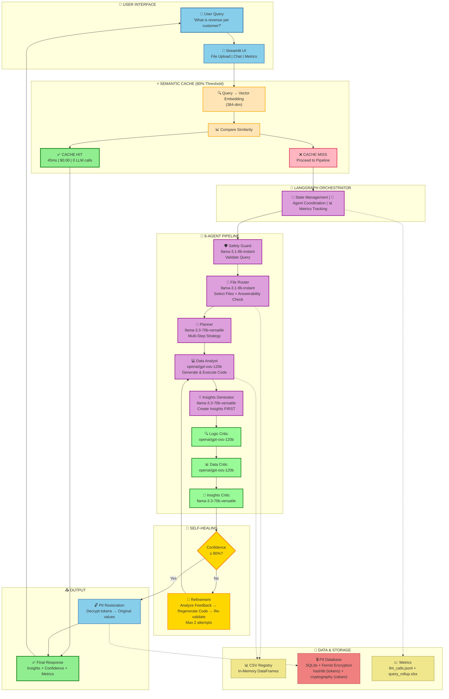

# System Architecture

```mermaid
graph TB
    subgraph UI["🎨 USER INTERFACE"]
        User["👤 User Query<br/>'What is revenue per customer?'"]
        Streamlit["📱 Streamlit UI<br/>File Upload | Chat | Metrics"]
    end

    subgraph Cache["⚡ SEMANTIC CACHE (80% Threshold)"]
        Vector["🔍 Query → Vector Embedding<br/>(384-dim)"]
        Compare["📊 Compare Similarity"]
        Hit["✅ CACHE HIT<br/>45ms | $0.00 | 0 LLM calls"]
        Miss["❌ CACHE MISS<br/>Proceed to Pipeline"]
    end

    subgraph Orchestrator["🎯 LANGGRAPH ORCHESTRATOR"]
        State["📝 State Management | 🔄 Agent Coordination | 📊 Metrics Tracking"]
    end

    subgraph Agents["🤖 8-AGENT PIPELINE"]
        A1["🛡️ Safety Guard<br/>llama-3.1-8b-instant<br/>Validate Query"]
        A2["📂 File Router<br/>llama-3.1-8b-instant<br/>Select Files + Answerability Check"]
        A3["🧠 Planner<br/>llama-3.3-70b-versatile<br/>Multi-Step Strategy"]
        A4["💻 Data Analyst<br/>openai/gpt-oss-120b<br/>Generate & Execute Code"]
        A5["💡 Insights Generator<br/>llama-3.3-70b-versatile<br/>Create Insights FIRST"]
        A6["🔍 Logic Critic<br/>openai/gpt-oss-120b"]
        A7["📊 Data Critic<br/>openai/gpt-oss-120b"]
        A8["💭 Insights Critic<br/>llama-3.3-70b-versatile"]
    end

    subgraph Refinement["🔧 SELF-HEALING"]
        Check{"Confidence<br/>≥ 80%?"}
        Refine["🔄 Refinement<br/>Analyze Feedback → Regenerate Code → Re-validate<br/>Max 2 attempts"]
    end

    subgraph Storage["💾 DATA & STORAGE"]
        CSV["📊 CSV Registry<br/>In-Memory DataFrames"]
        PII["🔒 PII Database<br/>SQLite + Fernet Encryption<br/>hashlib (tokens) + cryptography (values)"]
        MetricsDB["📈 Metrics<br/>llm_calls.jsonl + query_rollup.xlsx"]
    end

    subgraph Output["📤 OUTPUT"]
        Restore["🔓 PII Restoration<br/>Decrypt tokens → Original values"]
        Response["✅ Final Response<br/>Insights + Confidence + Metrics"]
    end

    User --> Streamlit
    Streamlit --> Vector
    Vector --> Compare
    Compare --> Hit
    Compare --> Miss
    Hit --> Response
    Miss --> State
    
    State --> A1
    A1 --> A2
    A2 --> A3
    A3 --> A4
    A4 --> A5
    A5 --> A6
    A6 --> A7
    A7 --> A8
    
    A8 --> Check
    Check -->|Yes| Restore
    Check -->|No| Refine
    Refine --> A4
    
    A2 -.-> CSV
    A4 -.-> CSV
    Restore -.-> PII
    State -.-> MetricsDB
    
    Restore --> Response
    Response --> User

    style User fill:#87CEEB,stroke:#4682B4,stroke-width:3px
    style Streamlit fill:#87CEEB,stroke:#4682B4,stroke-width:2px
    style Vector fill:#FFE4B5,stroke:#FFA500,stroke-width:2px
    style Compare fill:#FFE4B5,stroke:#FFA500,stroke-width:2px
    style Hit fill:#90EE90,stroke:#228B22,stroke-width:3px
    style Miss fill:#FFB6C1,stroke:#DC143C,stroke-width:2px
    style State fill:#DDA0DD,stroke:#8B008B,stroke-width:2px
    style A1 fill:#DDA0DD,stroke:#8B008B,stroke-width:2px
    style A2 fill:#DDA0DD,stroke:#8B008B,stroke-width:2px
    style A3 fill:#DDA0DD,stroke:#8B008B,stroke-width:2px
    style A4 fill:#DDA0DD,stroke:#8B008B,stroke-width:2px
    style A5 fill:#DDA0DD,stroke:#8B008B,stroke-width:2px
    style A6 fill:#98FB98,stroke:#006400,stroke-width:2px
    style A7 fill:#98FB98,stroke:#006400,stroke-width:2px
    style A8 fill:#98FB98,stroke:#006400,stroke-width:2px
    style Check fill:#FFD700,stroke:#FF8C00,stroke-width:3px
    style Refine fill:#FFD700,stroke:#FF8C00,stroke-width:2px
    style CSV fill:#F0E68C,stroke:#BDB76B,stroke-width:2px
    style PII fill:#F08080,stroke:#CD5C5C,stroke-width:2px
    style MetricsDB fill:#F0E68C,stroke:#BDB76B,stroke-width:2px
    style Restore fill:#87CEEB,stroke:#4682B4,stroke-width:2px
    style Response fill:#90EE90,stroke:#228B22,stroke-width:3px
```